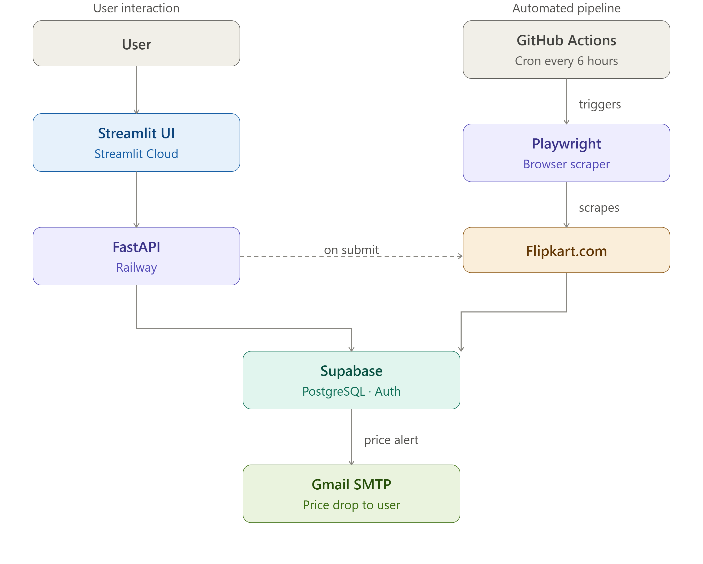
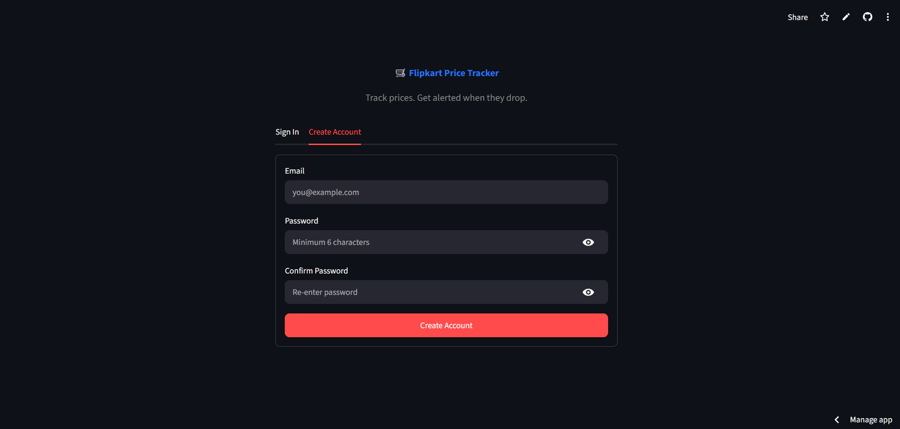
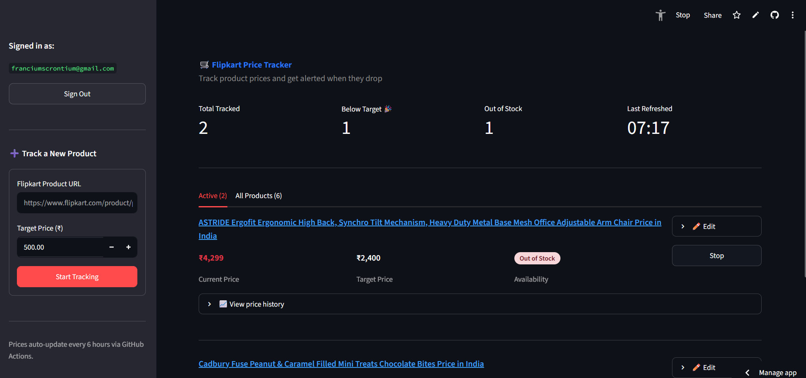
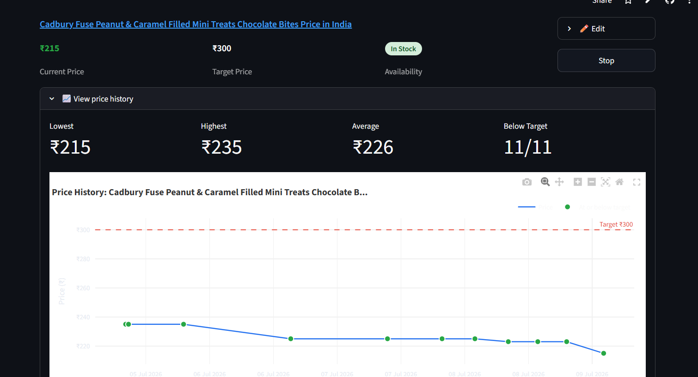

# 🛒 Flipkart Price Tracker

A full-stack price tracking application that monitors Flipkart product prices 
and sends email alerts when prices drop below your target.

## 🔗 Live Demo
https://flipkart-price-tracker-257.streamlit.app

## Features
- Track any Flipkart product price in real time
- Email alerts when price drops below your target
- Interactive price history charts
- Secure authentication with email and password
- Automated price checks every 6 hours via GitHub Actions
- REST API with full Swagger documentation

## Tech Stack
| Layer | Technology |
|-------|-----------|
| Frontend | Streamlit |
| Backend | FastAPI |
| Database | PostgreSQL (Supabase) |
| Auth | Supabase Auth (JWT) |
| Scraping | Playwright + BeautifulSoup |
| Scheduling | GitHub Actions (cron) |
| Email | Gmail SMTP |
| Deployment | Railway (API) + Streamlit Cloud (UI) |

## Architecture


## Getting Started (Local Setup)

### Prerequisites
- Python 3.12+
- PostgreSQL (or Supabase account)

### Installation
```bash
git clone https://github.com/kriti219/Price-Tracker
cd Price-Tracker
python -m venv venv
source venv/Scripts/activate
pip install -r requirements.txt
playwright install chromium
```

### Environment Variables
Create a `.env` file:

DATABASE_URL=your_supabase_connection_string
SUPABASE_URL=your_supabase_url
SUPABASE_ANON_KEY=your_anon_key
GMAIL_SENDER_EMAIL=your_gmail
GMAIL_APP_PASSWORD=your_app_password
API_BASE_URL=http://127.0.0.1:8000

### Run locally
```bash
# Terminal 1: FastAPI
uvicorn main:app --reload

# Terminal 2: Streamlit
streamlit run streamlit_app/app.py
```

## Project Structure

Price-Tracker/
├── main.py              # FastAPI backend
├── scraper.py           # Playwright scraper
├── scrape_job.py        # Scheduled scrape job
├── email_alert.py       # Gmail SMTP alerts
├── schemas.py           # Pydantic models
├── api_client.py        # HTTP client for Streamlit
├── charts.py            # Plotly chart builder
├── db/
│   ├── connection.py    # SQLAlchemy engine
│   ├── models.py        # Database models
│   └── crud.py          # Database operations
├── auth/
│   └── supabase_auth.py # Supabase auth client
└── streamlit_app/
    └── app.py           # Streamlit dashboard

## How It Works
1. User signs up and adds a Flipkart product URL with a target price
2. FastAPI scrapes the product immediately and stores the price
3. GitHub Actions runs every 6 hours, scrapes all tracked products
4. If price drops below target, an email alert is sent automatically
5. Price history is stored in PostgreSQL and visualized as charts

## Known Limitations
- Flipkart only (no Amazon/Meesho support yet)
- Playwright selectors may need updating if Flipkart changes its HTML structure
- Railway free tier has $5/month credit limit

## License
MIT

## 📸 Screenshots

### Login Screen


### Dashboard


### Price History Chart
